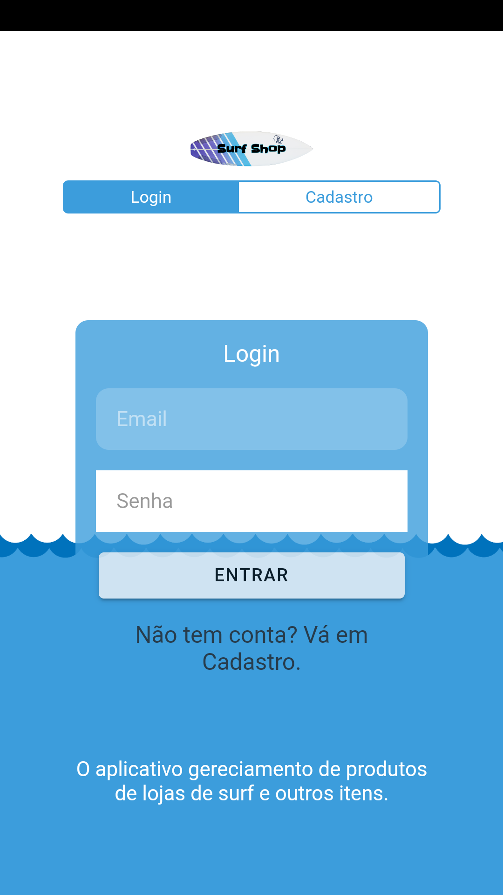

# Myshop
   
## App feito para vendas de items esportivos de surf e outros;

  

    
  

- Versão 1.3 atual - Correções nas informações dos produtos.

- Versão 1.2 - Solução do erro na barra de status do aplicativo, 
como também na redução da foto de perfil.

- Versão 1.1 - Soluções de erros em privacidade.

- Versão 1.0 - Melhorias no design do App e no banco de dados.

## Para instalar o projeto veja algumas orientações abaixos:

 - Precisa instalar o nodejs lts 10.16:
    baixe nodejs: https://nodejs.org/en/
    baixe yarn: `npm i -g yarn`

 - Logo após ter instalado, digite no terminal:
    `npm i` ou `yarn`
    
 - Depois digite: 
   `ionic serve` ou `yarn start`

 - Para versão build para Android ou ios: 
    `ionic cordova build android`

 - Para versão build para Android ou ios: 
    `ionic cordova build android`

 - Para versão mobile Android: 
    `ionic cordova run android`
    
 - Para versão mobile iOS:   
    `ionic cordova run ios`

Mais informações no site do ionic framework: 
    https://ionicframework.com/docs
    

